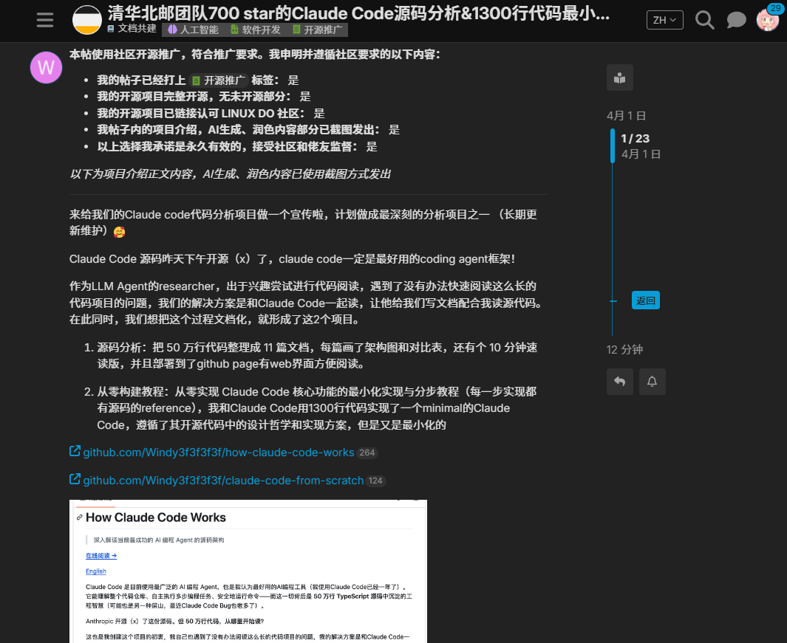
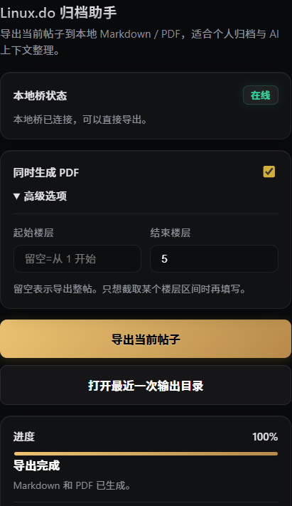
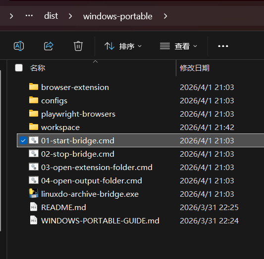
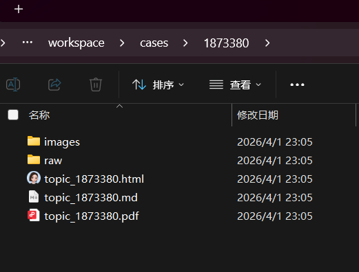
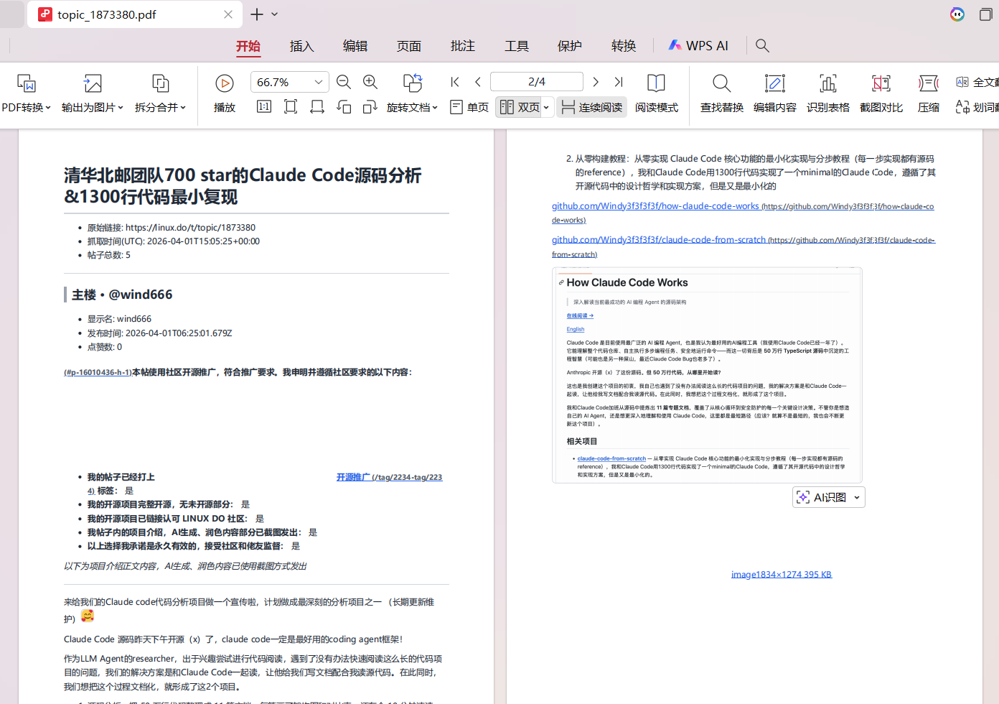
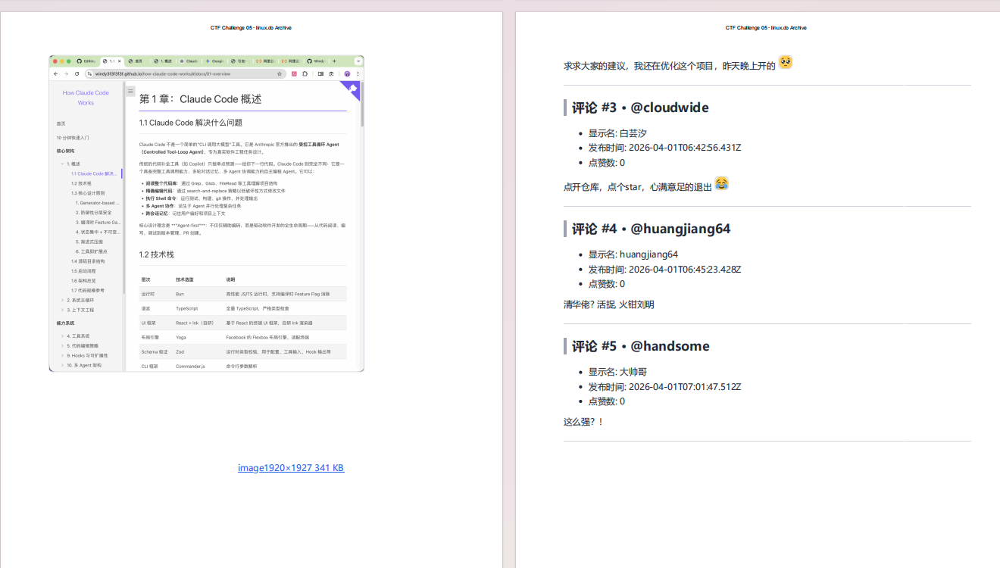

# Linux.do 归档助手

> 一键把 Linux.do 帖子导出成 Markdown 和带图 PDF，方便本地留档，也方便直接喂给 AI。

Linux.do 上有很多高质量长帖，正文、评论、截图、资源链接往往混在一起。真正想把这些内容保存下来、继续整理、继续提问时，体验并不顺：复制粘贴容易丢格式，图片经常带不走，帖子一长手动整理也很累。

这个项目就是为了解决这件事：**把当前打开的帖子快速导出成一份可保存、可转发、可继续利用的本地资料。**

---

## 它解决什么问题

如果你也遇到过这些情况，这个工具大概率就是给你准备的：

- 想把 Linux.do 的好帖长期留档
- 想把帖子继续丢给 Claude / ChatGPT / Gemini 做整理或提问
- 希望保留图片，而不只是留下一份纯文字
- 不想再手动复制、贴图、拼上下文

典型流程就是：

**打开帖子 → 点扩展导出 → 拿到本地 PDF / Markdown → 继续喂给 AI**

---

## 效果预览

### 帖子页示例



### 扩展面板



### Windows 便携版目录

普通用户直接解压后，双击 `01-start-bridge.cmd` 即可启动本地桥。



### 导出后的目录结构

每个帖子都会单独生成一个目录，里面包含 Markdown、PDF、原始 JSON 和图片资源。



### 导出的 PDF 效果





---

## 主要功能

- 一键导出当前帖子
- 保存 Markdown、原始 JSON、图片资源
- 生成带图 PDF
- 支持按楼层范围导出
- 扩展面板显示导出进度
- 导出完成后一键打开输出目录
- Windows 便携版可直接分发给普通用户使用

---

## 快速开始

### Windows 便携版

适合普通用户，不需要自己配置 Python。

1. 下载并解压便携包
2. 双击 `01-start-bridge.cmd`
3. 打开 Chrome，进入 `chrome://extensions/`
4. 开启“开发者模式”
5. 选择“加载已解压的扩展程序”
6. 选择便携包里的 `browser-extension` 目录
7. 打开任意 Linux.do 帖子，点击扩展里的“导出当前帖子”

导出结果默认会放到：

```text
windows-portable/workspace/cases/
```

### 源码运行

适合开发者，或想自己修改项目的人。

环境要求：

- Python 3.12+
- `uv`

示例：

```bash
git clone https://github.com/sakura11111111111111/linuxdo-archive-assistant
cd linuxdo-archive
uv sync
uv run playwright install chromium
uv run python local_bridge_server.py
```

然后在 Chrome 中加载 `browser-extension/` 即可。

---

## 输出结构

每个帖子导出后会生成一个单独目录，例如：

```text
workspace/cases/1773192/
  topic_1773192.md
  topic_1773192.pdf
  raw/topic_1773192.json
  images/
```

其中：

- `topic_xxx.md`：适合继续编辑、整理、检索
- `topic_xxx.pdf`：适合直接分享、存档、喂给 AI
- `raw/topic_xxx.json`：原始数据备份
- `images/`：本地化后的图片资源

---

## 安全说明

这个项目的定位一直比较克制：

- 只处理你当前打开的帖子
- 不做批量抓站
- 不存账号密码
- 不导出 Cookie
- 本地桥只监听 `127.0.0.1`
- 数据尽量在本地处理

它更接近一个“本地归档助手”，而不是一个面向批量采集的爬虫工具。

---

## 适合谁

- 想长期保存 Linux.do 优质内容的人
- 想把帖子内容继续交给 AI 分析的人
- 想保留图文上下文的人
- 想把论坛内容整理成本地知识库素材的人

---

## 项目结构

- `browser-extension/`：浏览器扩展
- `local_bridge_server.py`：本地桥服务
- `archive_core.py`：归档核心逻辑
- `scripts/`：构建和辅助脚本
- `packaging/`：便携版打包配置
- `docs/`：文档与发布材料
- `dist/windows-portable/`：Windows 便携版成品目录

---

## 项目状态

当前项目已经具备可分享、可开源、可分发的基础形态：

- 核心导出链路可用
- Windows 便携版已打通
- 可双击启动本地桥
- 扩展面板可显示进度
- 适合继续面向社区发布和收集反馈

---

## 开源与反馈

如果你想：

- 反馈 Bug
- 提功能建议
- 自己改造这套工具
- 直接拿去做个人归档

欢迎提交 Issue 或 Pull Request，也欢迎直接把便携版分享给身边有同样需求的人。

---

## 仓库地址

- GitHub：<https://github.com/sakura11111111111111/linuxdo-archive-assistant>
- Releases：<https://github.com/sakura11111111111111/linuxdo-archive-assistant/releases>

